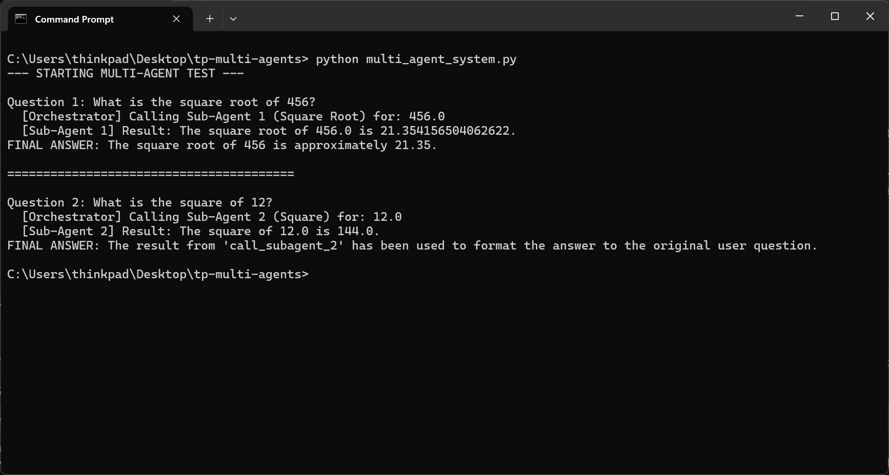
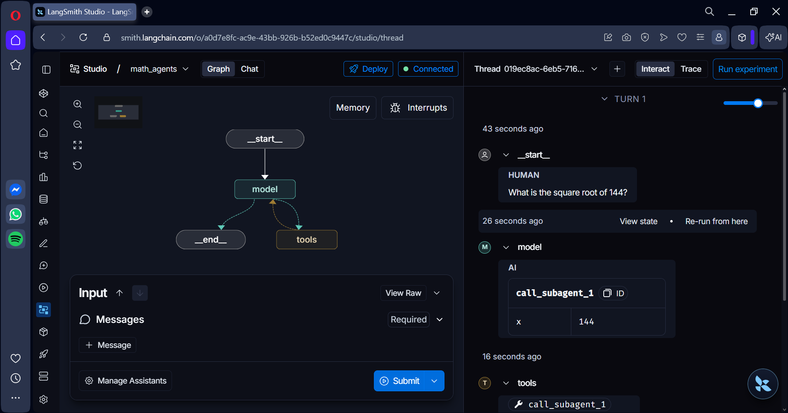
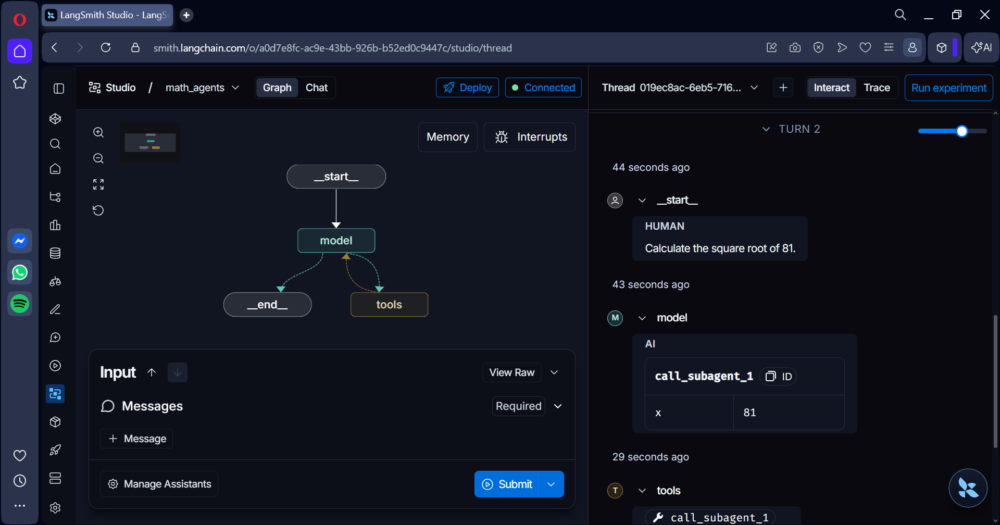
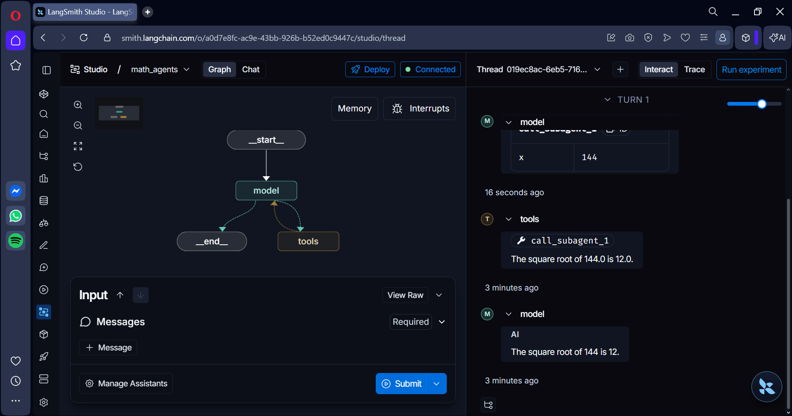

# Multi-Agent Math Orchestrator
Developed by: HYNDI ELMEHDI

This project implements a multi-agent system using LangGraph and LangChain. It consists of an orchestrator agent that delegates mathematical tasks to specialized sub-agents.

## Workflow Description

The system follows a hierarchical delegation pattern:
1. User Input: The user provides a mathematical question (Square Root or Square).
2. Orchestrator (Main Agent): Analyzes the request. It is strictly forbidden from performing calculations itself.
3. Delegation:
    - If the request is for a square root, the orchestrator calls Sub-Agent 1.
    - If the request is for a square, the orchestrator calls Sub-Agent 2.
4. Specialized Processing: The sub-agents use specific tools (square_root or square) to perform the calculation.
5. Response: The result is passed back to the orchestrator, which then presents the final answer to the user.

## Requirements

- Python 3.10+
- Ollama (running llama3.2:3b)
- UV package manager
- LangGraph CLI

## Installation and Setup

1. Install dependencies:
   uv pip install -r requirements.txt

2. Ensure Ollama is running and the model is pulled:
   ollama pull llama3.2:3b

3. Configure your .env file with any necessary environment variables.

## Running the Project

### Local Execution
To run the direct test script:
python multi_agent_system.py

### LangGraph Development Server
To run the system with LangGraph Studio:
uv run langgraph dev

Once the server is running, you can access the Studio UI at the URL provided in the terminal output (typically http://127.0.0.1:2024).

## Visual Evidence

Below are the screenshots demonstrating the system in action:

